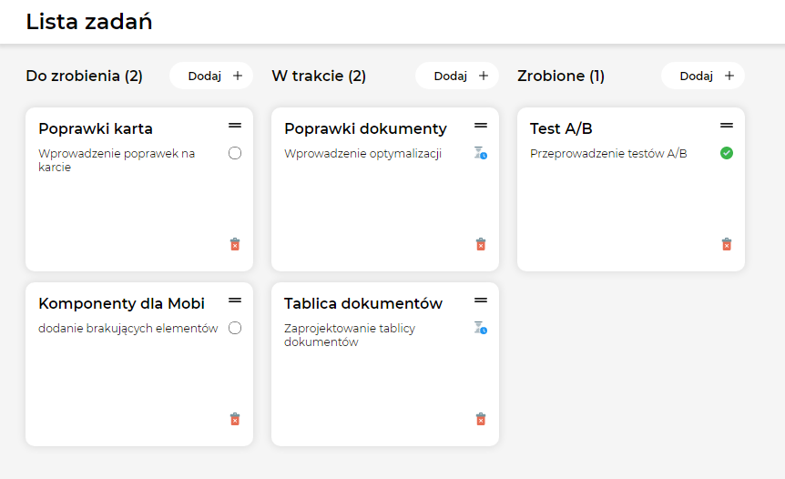

# :tada: ReasonStore

React Todo application.

## :rocket: Functionalities
**Main functionalities:**

* Task can be added to the list for each of the three states (to-do / in progress / done)
* After clicking add button, the task element appears on the screen, where you can enter the title and description of the task
* The task must have at least a title - adding without a title is not possible and the user is informed about it

**Unfinished functionalities:**
* Saving tasks after exiting the web browser
* The ability to move tasks between states (Drag and Drop)

## :wrench: Tools

**The following tools were used in project:**
* **[React](https://github.com/facebook/react)** - Main technology
* **[Redux](https://github.com/reduxjs/redux)** - State container, helped write application to behave consistently
* **[Styled-components](https://github.com/styled-components/styled-components)** - Writing styles
* **[Storybook](https://github.com/storybookjs/storybook)** - Build UI components
* **[Formik](https://github.com/formium/formik)** - Open source form library for React, helped in write forms
* **[PropTypes](https://reactjs.org/docs/typechecking-with-proptypes.html)** - Checking for React props and similar objects

## :construction_worker: Install

### `npm install`

Installs the necessary application dependencies

## Available Scripts

In the project directory, you can run:

### `npm start`

Runs the app in the development mode. 
Open [http://localhost:3000](http://localhost:3000) to view it in the browser.

### `npm run storybook`

Runs the app in storybook. 
Open [http://localhost:9009](http://localhost:9009) to view it in the browser.

### `npm run test`

Launches the test runner in the interactive watch mode.

## :movie_camera: Live

https://eszczepan-todo-app.netlify.app
